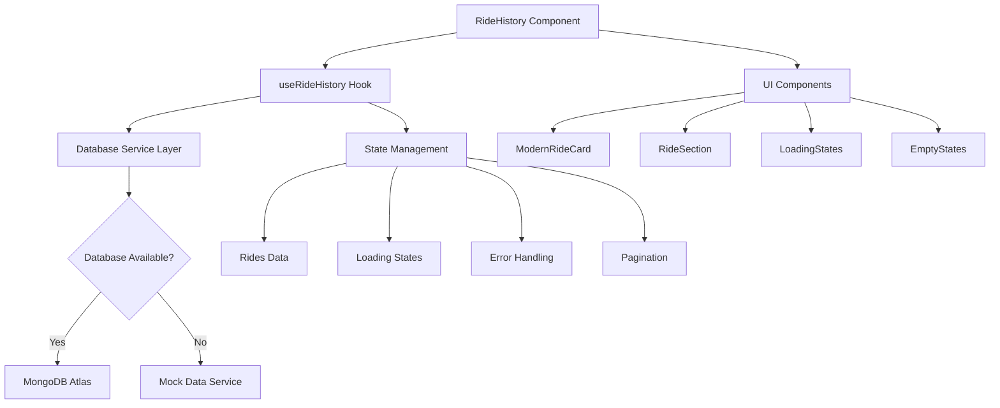

# Design Document

## Overview

The Modern Ride History Redesign focuses on creating a robust, database-compatible ride history interface that gracefully handles both connected and disconnected states. The design emphasizes modern UI patterns, performance optimization, and seamless fallback mechanisms to ensure users always have access to their ride information.

## Architecture

### High-Level Architecture



### Data Flow Architecture

1. **Component Initialization**: RideHistory component mounts and initializes useRideHistory hook
2. **Authentication Check**: Verify user token and determine user type (rider/captain)
3. **Database Connection**: Attempt connection to MongoDB Atlas
4. **Fallback Logic**: If database fails, seamlessly switch to mock data service
5. **Data Processing**: Transform and classify rides by date categories
6. **UI Rendering**: Display rides with modern card components and loading states

## Components and Interfaces

### Core Components

#### 1. Enhanced RideHistory Component
```typescript
interface RideHistoryProps {
  userType?: 'user' | 'captain';
  initialFilters?: RideFilters;
}

interface RideHistoryState {
  expandedSections: Record<string, boolean>;
  filters: RideFilters;
  searchQuery: string;
}
```

#### 2. Enhanced useRideHistory Hook
```typescript
interface UseRideHistoryReturn {
  rides: Ride[];
  loading: boolean;
  error: string | null;
  pagination: PaginationState;
  dataSource: 'database' | 'mock';
  
  // Actions
  fetchRideHistory: (options?: FetchOptions) => Promise<void>;
  refresh: () => void;
  loadMore: () => void;
  filterByStatus: (status: RideStatus) => void;
  searchRides: (query: string) => void;
  
  // Computed
  classifyRidesByDate: () => ClassifiedRides;
  getRideStats: () => RideStats;
  hasRides: boolean;
}
```

#### 3. Database Service Layer
```typescript
interface DatabaseService {
  isConnected: () => boolean;
  getUserRides: (userId: string, options: FetchOptions) => Promise<RideResponse>;
  handleConnectionError: (error: Error) => void;
}

interface MockDataService {
  generateMockRides: (count: number) => Ride[];
  getSriLankanLocations: () => Location[];
  createRealisticRideScenarios: () => Ride[];
}
```

#### 4. Modern UI Components
```typescript
interface ModernRideCardProps {
  ride: Ride;
  onClick?: (ride: Ride) => void;
  showDetails?: boolean;
  compact?: boolean;
}

interface RideSectionProps {
  title: string;
  rides: Ride[];
  isExpanded: boolean;
  onToggle: () => void;
  emptyMessage?: string;
}
```

### Component Hierarchy

```
RideHistory
├── Header
│   ├── BackButton
│   ├── Title & Stats
│   └── RefreshButton
├── FilterBar (optional)
│   ├── StatusFilter
│   ├── DateRangeFilter
│   └── SearchInput
├── Content
│   ├── LoadingState (RideHistorySkeleton)
│   ├── ErrorState
│   ├── EmptyState
│   └── RideSections
│       ├── TodaySection
│       ├── YesterdaySection
│       └── EarlierSection
└── Footer (pagination/load more)
```

## Data Models

### Enhanced Ride Model
```typescript
interface Ride {
  _id: string;
  user: string | User;
  captain?: string | Captain;
  pickup: string;
  destination: string;
  fare: number;
  vehicle: VehicleType;
  status: RideStatus;
  duration?: number; // seconds
  distance?: number; // meters
  paymentID?: string;
  orderId?: string;
  signature?: string;
  messages?: RideMessage[];
  createdAt: string;
  updatedAt: string;
  
  // Computed fields
  estimatedDuration?: number;
  routePolyline?: string;
  rating?: number;
}

type RideStatus = 'pending' | 'accepted' | 'ongoing' | 'completed' | 'cancelled';
type VehicleType = 'car' | 'auto' | 'bike';
```

### Pagination and Filtering
```typescript
interface PaginationState {
  page: number;
  limit: number;
  total: number;
  pages: number;
  hasMore: boolean;
}

interface RideFilters {
  status?: RideStatus[];
  dateRange?: {
    start: Date;
    end: Date;
  };
  vehicleType?: VehicleType[];
  minFare?: number;
  maxFare?: number;
}

interface ClassifiedRides {
  today: Ride[];
  yesterday: Ride[];
  earlier: Ride[];
}

interface RideStats {
  total: number;
  completed: number;
  cancelled: number;
  totalFare: number;
  averageFare: number;
  totalDistance: number;
  totalDuration: number;
}
```

### Mock Data Structure
```typescript
interface MockRideData {
  sriLankanLocations: Location[];
  vehicleTypes: VehicleType[];
  statusDistribution: Record<RideStatus, number>;
  fareRanges: Record<VehicleType, { min: number; max: number }>;
  timePatterns: TimePattern[];
}

interface Location {
  name: string;
  district: string;
  coordinates: [number, number];
  type: 'city' | 'town' | 'landmark';
}
```

## Error Handling

### Database Connection Errors
1. **Connection Timeout**: Implement exponential backoff retry mechanism
2. **Authentication Failure**: Clear invalid tokens and redirect to login
3. **Network Issues**: Show offline indicator and enable mock data mode
4. **Server Errors**: Display user-friendly error messages with retry options

### Error Recovery Strategies
```typescript
interface ErrorRecoveryStrategy {
  retryAttempts: number;
  backoffMultiplier: number;
  fallbackToMock: boolean;
  showUserNotification: boolean;
  logError: boolean;
}

const errorStrategies: Record<string, ErrorRecoveryStrategy> = {
  'NETWORK_ERROR': {
    retryAttempts: 3,
    backoffMultiplier: 2,
    fallbackToMock: true,
    showUserNotification: true,
    logError: true
  },
  'AUTH_ERROR': {
    retryAttempts: 1,
    backoffMultiplier: 1,
    fallbackToMock: false,
    showUserNotification: true,
    logError: true
  },
  'SERVER_ERROR': {
    retryAttempts: 2,
    backoffMultiplier: 1.5,
    fallbackToMock: true,
    showUserNotification: true,
    logError: true
  }
};
```

## Testing Strategy

### Unit Testing
1. **Hook Testing**: Test useRideHistory with various scenarios
2. **Component Testing**: Test RideHistory component rendering and interactions
3. **Service Testing**: Test database and mock data services
4. **Utility Testing**: Test date classification and ride statistics functions

### Integration Testing
1. **Database Integration**: Test real database connections and queries
2. **Mock Data Integration**: Test fallback to mock data scenarios
3. **Error Handling**: Test various error conditions and recovery
4. **Performance Testing**: Test with large datasets and pagination

### Test Scenarios
```typescript
describe('RideHistory Integration Tests', () => {
  test('should load real data when database is available');
  test('should fallback to mock data when database is unavailable');
  test('should handle authentication errors gracefully');
  test('should paginate large datasets efficiently');
  test('should filter and search rides correctly');
  test('should maintain state during data source switches');
});
```

## Performance Optimizations

### Data Loading Optimizations
1. **Lazy Loading**: Implement virtual scrolling for large ride lists
2. **Caching**: Cache ride data with appropriate TTL
3. **Pagination**: Load rides in chunks to reduce initial load time
4. **Prefetching**: Preload next page of rides during idle time

### UI Performance
1. **Skeleton Loading**: Show content placeholders during loading
2. **Smooth Animations**: Use CSS transforms for better performance
3. **Image Optimization**: Lazy load captain avatars and vehicle images
4. **Bundle Splitting**: Code split ride history components

### Memory Management
```typescript
interface PerformanceConfig {
  maxCachedRides: number;
  cacheExpiryTime: number;
  virtualScrollThreshold: number;
  prefetchDistance: number;
}

const performanceConfig: PerformanceConfig = {
  maxCachedRides: 100,
  cacheExpiryTime: 5 * 60 * 1000, // 5 minutes
  virtualScrollThreshold: 50,
  prefetchDistance: 10
};
```

## Security Considerations

### Data Protection
1. **Token Validation**: Verify JWT tokens on every request
2. **Data Sanitization**: Sanitize all user inputs and API responses
3. **HTTPS Only**: Ensure all API calls use HTTPS
4. **Rate Limiting**: Implement client-side rate limiting for API calls

### Privacy
1. **Data Minimization**: Only fetch necessary ride data
2. **Sensitive Data**: Mask sensitive information in logs
3. **User Consent**: Respect user privacy preferences
4. **Data Retention**: Implement appropriate data retention policies

## Accessibility Features

### WCAG 2.1 Compliance
1. **Keyboard Navigation**: Full keyboard accessibility
2. **Screen Reader Support**: Proper ARIA labels and descriptions
3. **Color Contrast**: Meet AA contrast requirements
4. **Focus Management**: Clear focus indicators and logical tab order

### Inclusive Design
1. **Responsive Design**: Work on all device sizes
2. **Touch Targets**: Minimum 44px touch targets
3. **Loading States**: Clear loading indicators
4. **Error Messages**: Descriptive error messages

## Deployment Considerations

### Environment Configuration
```typescript
interface EnvironmentConfig {
  apiBaseUrl: string;
  mockDataEnabled: boolean;
  retryAttempts: number;
  cacheEnabled: boolean;
  debugMode: boolean;
}
```

### Monitoring and Analytics
1. **Error Tracking**: Monitor database connection failures
2. **Performance Metrics**: Track page load times and API response times
3. **User Analytics**: Track user interactions and feature usage
4. **Health Checks**: Monitor system health and availability