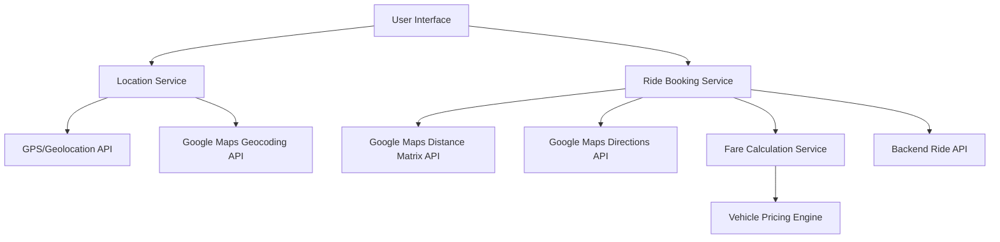
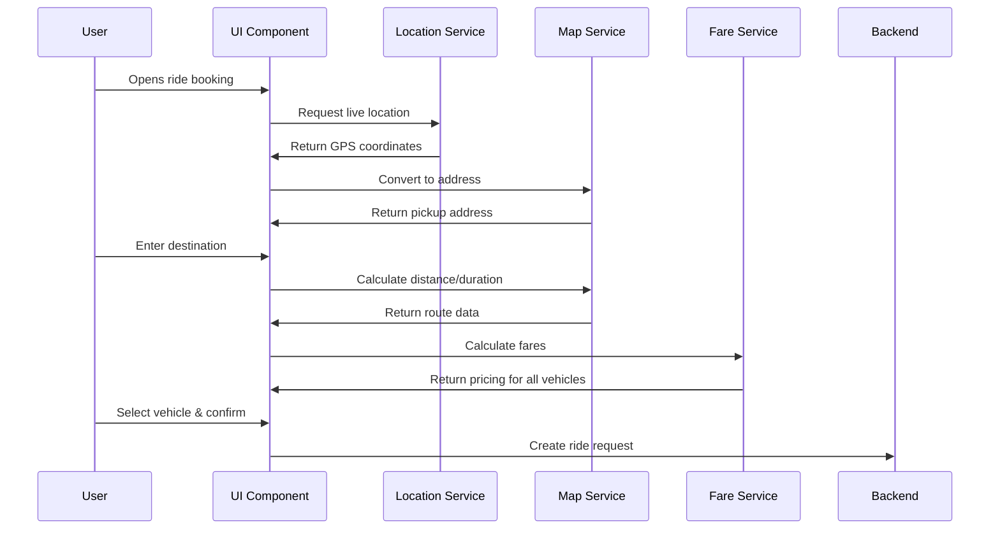

# Real-time Location Ride Booking Design

## Overview

This design implements a real-time location-based ride booking system that automatically uses the user's live GPS coordinates as pickup location and integrates with Google Maps APIs for accurate distance, duration, and route calculations. The system provides seamless location tracking and precise fare calculations for multiple vehicle types.

## Architecture

### High-Level Architecture



### Component Interaction Flow



## Components and Interfaces

### 1. Enhanced Location Service

**Purpose:** Manages real-time GPS tracking and location accuracy

**Key Methods:**
```typescript
interface LocationService {
  getCurrentLocation(): Promise<LocationData>
  watchLocation(callback: LocationCallback): WatchId
  clearWatch(watchId: WatchId): void
  getLocationAccuracy(): number
  isLocationStale(): boolean
}

interface LocationData {
  latitude: number
  longitude: number
  accuracy: number
  timestamp: number
  address?: string
}
```

**Implementation Details:**
- Uses HTML5 Geolocation API with high accuracy settings
- Implements continuous location watching for real-time updates
- Validates location accuracy and retries if needed
- Caches last known good location for offline scenarios

### 2. Google Maps Integration Service

**Purpose:** Handles all Google Maps API interactions for geocoding, distance calculation, and routing

**Key Methods:**
```typescript
interface MapService {
  geocodeCoordinates(lat: number, lng: number): Promise<string>
  calculateDistance(origin: string, destination: string): Promise<DistanceData>
  getDirections(origin: string, destination: string): Promise<RouteData>
  searchPlaces(query: string): Promise<PlaceSuggestion[]>
}

interface DistanceData {
  distance: {
    text: string
    value: number // in meters
  }
  duration: {
    text: string
    value: number // in seconds
  }
  status: string
}

interface RouteData {
  routes: Route[]
  status: string
}
```

**Implementation Details:**
- Integrates Google Maps Distance Matrix API for accurate calculations
- Uses Google Places API for location suggestions
- Implements Google Directions API for route visualization
- Handles API rate limiting and error scenarios

### 3. Real-time Fare Calculator

**Purpose:** Calculates accurate pricing based on real distance and duration data

**Key Methods:**
```typescript
interface FareCalculator {
  calculateFares(distance: number, duration: number): Promise<VehicleFares>
  getFareBreakdown(vehicleType: VehicleType, distance: number, duration: number): FareBreakdown
  applySurgeMultiplier(baseFare: number, surgeRate: number): number
}

interface VehicleFares {
  bike: number
  auto: number
  car: number
}

interface FareBreakdown {
  baseFare: number
  distanceCharge: number
  timeCharge: number
  surgeMultiplier: number
  totalFare: number
}
```

**Implementation Details:**
- Uses actual Google Maps distance and duration for calculations
- Applies different pricing models for each vehicle type
- Implements surge pricing based on demand
- Provides detailed fare breakdown for transparency

### 4. Enhanced Ride Booking Component

**Purpose:** Main UI component that orchestrates location tracking, route calculation, and ride creation

**Key Features:**
- Real-time location display with accuracy indicator
- Auto-updating pickup location as user moves
- Live distance and duration calculations
- Dynamic fare updates based on route changes
- Vehicle selection with detailed pricing
- Route visualization on embedded map

## Data Models

### Location Model
```typescript
interface Location {
  coordinates: {
    latitude: number
    longitude: number
  }
  address: string
  accuracy: number
  timestamp: Date
  isLive: boolean
}
```

### Ride Request Model
```typescript
interface RideRequest {
  id: string
  userId: string
  pickup: Location
  destination: Location
  vehicleType: 'bike' | 'auto' | 'car'
  distance: number // in meters
  estimatedDuration: number // in seconds
  fare: FareBreakdown
  route: RouteData
  status: RideStatus
  createdAt: Date
}
```

### Route Model
```typescript
interface Route {
  distance: number
  duration: number
  polyline: string
  steps: RouteStep[]
  bounds: LatLngBounds
}
```

## Error Handling

### Location Errors
- **GPS Unavailable:** Fall back to manual location entry
- **Permission Denied:** Show permission request dialog with instructions
- **Low Accuracy:** Continue trying to improve accuracy, show warning if persistent
- **Location Timeout:** Use last known location with timestamp warning

### API Errors
- **Google Maps API Failure:** Implement retry logic with exponential backoff
- **Rate Limiting:** Queue requests and implement proper throttling
- **Network Errors:** Cache last known data and retry when connection restored
- **Invalid Locations:** Validate addresses and show specific error messages

### Calculation Errors
- **Distance Calculation Failed:** Use straight-line distance as fallback
- **Fare Calculation Error:** Show base fare estimates with warning
- **Route Not Found:** Display pickup and destination markers only

## Testing Strategy

### Unit Tests
- Location service accuracy and error handling
- Fare calculation logic with various distance/duration inputs
- Google Maps API response parsing and error scenarios
- Real-time location updates and state management

### Integration Tests
- End-to-end ride booking flow with live location
- Google Maps API integration with real coordinates
- Fare calculation accuracy with actual route data
- Location permission handling across different browsers

### Performance Tests
- Location update frequency and battery impact
- API response times under various network conditions
- Memory usage during continuous location tracking
- UI responsiveness during real-time updates

### User Acceptance Tests
- Location accuracy in various environments (indoor/outdoor)
- Fare calculation accuracy compared to actual routes
- User experience during location permission requests
- Ride booking flow completion rates

## Implementation Considerations

### Performance Optimization
- Debounce location updates to prevent excessive API calls
- Cache geocoding results for frequently used locations
- Implement efficient map rendering for route visualization
- Use service workers for offline location caching

### Security
- Validate all location data on backend
- Implement rate limiting for API calls
- Sanitize user input for destination searches
- Encrypt sensitive location data in transit

### Accessibility
- Provide text alternatives for map visualizations
- Ensure location input fields work with screen readers
- Implement keyboard navigation for vehicle selection
- Add voice announcements for location updates

### Browser Compatibility
- Handle different geolocation API implementations
- Provide fallbacks for older browsers
- Test location accuracy across mobile browsers
- Implement progressive enhancement for advanced features